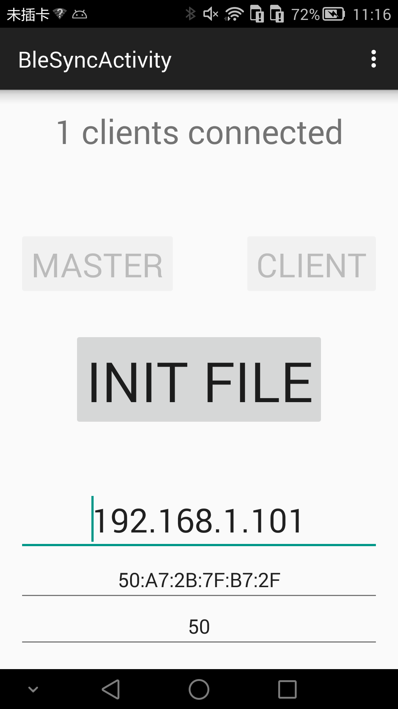
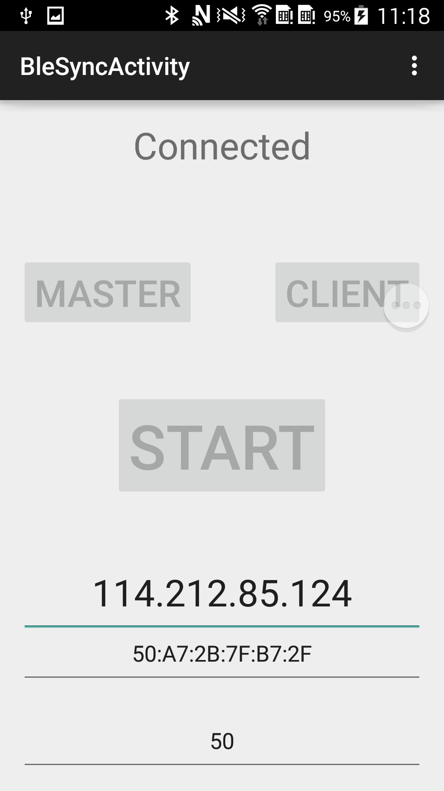

Multi Sensor DataCollector
===
# 目录
1. [项目简介](#项目简介)
2. [服务端demo](#服务端demo)
3. [待解决问题](#待解决问题)
4. [采集的数据类型](#采集的数据类型)
5. [参数修改](#参数修改)
6. [项目配置](#项目配置)
7. [使用方式](#使用方式)
8. [主要函数介绍](#主要函数介绍)


# 项目简介
* 用于多客户端传感器采集和发送;
* 可用于科研采集数据;
* 两种模式：一种采集后写本地csv（界面上writecsv 需要checked）；一种采集后socket发送服务端（界面上writecsv 需要unchecked）
* 支持一个主节点进行蓝牙控制（按MASTER），多个从节点同时开始采集数据（按CLIENT）；
* 支持android平台智能手表数据采集

  


# 服务端demo
* 若是以wifi连接服务端模式，见[服务端demo](https://github.com/LeoCai/Multi-Sensor-DataCollector/tree/master/MultiSensorCollecterServerDemo)
* 注意安卓端app中 writecsv 需要unchecked;


# 待解决问题
1. sockect模式下不能重复连接使用
2. sockect模式下传输数据丢包

# 采集的数据类型
* 加速度　Sensor.TYPE_ACCELEROMETE
* 陀螺仪　Sensor.TYPE_GYROSCOPE
* 磁力计　Sensor.TYPE_MAGNETIC_FIELD
* 重力　Sensor.TYPE_GRAVITY
* 线性加速度　Sensor.TYPE_LINEAR_ACCELERATION

修改位置：[MySensorManager.java](publiclibs/src/main/java/com/leocai/publiclibs/multidecicealign/MySensorManager.java)

# 参数修改
~~频率周期修改: [CollectorConfig.java](multi_sensor_collector/src/main/java/com/leocai/multidevicesalign/CollectorConfig.java)~~
# 项目配置
```gradle
compileSdkVersion 23
buildToolsVersion "23.0.1"
```
## 关联项目
* [sokect传输框架](https://github.com/LeoCai/iSpaceSync)：jar包依赖
* [sokect PC 服务端](https://github.com/LeoCai/SpaceSync-PC-Demo)：若为socket模式须安装PC或Android服务端
* [sokect android 服务端](https://github.com/LeoCai/SpaceSync-Android-Demo)：若为socket模式须安装PC或Android服务端

# 使用方式
1. 安装multi_sensor_collector module到各个手机上
2. 在控制主手机上点击MASTER
3. 在传感器手机熵点击CLIENT，从手机显示CONNECTED, 主手机显示1 CONNCECTED
4. 若为本地采集CSV模式：
  1. 输入文件名
  2. 按下主手机上的INIT FILE
  3. 从手机显示FILE　INITED
  4. 主手机按下START，从手机显示STARTING，开始采集数据到本地csv
5. 若为sockect传输模式
  1. 输入主机IP地址
  2. 按下助手及上的INIT FILE
  3. 从手机显示FILE INITED，服务端显示...CONNECTED
  4. 主手机按下START，服务端按下READY，开始传输数据
  
# 主要函数介绍
## module 介绍
* <strong>multi_sensor_collector</strong>: 项目界面模块，用于安装app，依赖publiclibs，包含蓝牙服务端和蓝牙客户端
* <strong>publiclibs</strong> : 封装了采集数据和传输框架，依赖spacesync.jar，包括采集数据，数据格式，频率

## publiclibs
### 传感器采集核心类：[MySensorManager.java](https://github.com/LeoCai/Multi-Sensor-DataCollector/blob/master/publiclibs/src/main/java/com/leocai/publiclibs/multidecicealign/MySensorManager.java)
#### 调用方式
```java
MySensorManager　mySensorManager = new MySensorManager(contex); //初始化
mySensorManager.setGlobalWriter(new SensorSokectWriter()); //设置文件还是socket
mySensorManager.setFrequency(frequency); //设置频率
mySensorManager.startSensor();　//启动传感器
mySensorManager.setFileName("127.0.0.1"); //设置文件名或者ip地址
mySensorManager.startDetection(); //写文件或写socket
```

### 传感器数据结构类：[ShakingData.java](https://github.com/LeoCai/Multi-Sensor-DataCollector/blob/master/publiclibs/src/main/java/com/leocai/publiclibs/ShakingData.java)

### 蓝牙服务器：[BleServer.java](https://github.com/LeoCai/Multi-Sensor-DataCollector/blob/master/publiclibs/src/main/java/com/leocai/publiclibs/connection/BleServer.java)
#### 调用方式
```java
BleServer bleServer = new BleServer();//新建服务器实例
bleServer.addObserver(Observer);//添加状态监听
bleServer.listen();//等待客户端连接
bleServer.sendFileCommands(fileName);//连接成功后发送写文件名或服务器ip地址
bleServer.sendStartCommands();//发送开始采集命令
bleServer.sendStopCommands();//发送停止采集命令
bleServer.close();//关闭服务器
```

### 蓝牙客户端：[BleClient.java](https://github.com/LeoCai/Multi-Sensor-DataCollector/blob/master/publiclibs/src/main/java/com/leocai/publiclibs/multidecicealign/BleClient.java)
```java
BleClient bleClient = new BleClient(masterAddress);
//开始连接并设置相关回调函数
bleClient.connect(new ConnectedCallBack() {
                //设置连接回调函数
                    @Override
                    public void onConnected(InputStream in) {
                        showLog("Connected");
                    }
                }, new FileInitCallBack(){
                //设置文件名或ip地址接收回调函数
                    @Override
                    public void onFileReceived(InputStream in) {
                        BufferedReader br = new BufferedReader(new InputStreamReader(in));
                        try {
                            final String fileName = br.readLine();
                            mySensorManager.setFileName(fileName);
                            showLog("FILE INITED");
                        } catch (IOException e) {
                            showLog(e.getMessage());
                        }
                    }
                }, new StartCallBack() {
                //设置开始回调函数
                    @Override
                    public void onStart() {
                        showLog("STATING");
                        mySensorManager.startDetection();
                    }
                }, new StopCallBack() {
                //设置停止回调函数
                    @Override
                    public void onStop() {
                        showLog("STOPPED");
                        mySensorManager.stop();
                    }
                });
bleClient.close();//关闭客户端
```
### 版本更新：
### 程序运行时候遇到休眠状态则连接断开问题

#### 解决方法

1. 在manifest文件中添加以下权限`<uses-permissionandroid:name="android.permission.WAKE_LOCK" /> `

2. 在主程序oncreat中添加 `getWindow().addFlags(WindowManager.LayoutParams.FLAG_KEEP_SCREEN_ON);`

### 手机实时显示gps数据和经纬度

1. 在xml文件中添加两个textView，用于显示gps信息和经纬度信息。

2. 通过`主程序->MySensorManager->SensorGlobalWriter->ShakingData`逐层取数据，获得shakingdata中存储的gps信息和经纬度信息。

3. 在主程序中添加线程，间隔2s执行一次。通过获取到的gps信息和经纬度信息更细两个textView。

- 可能导致的问题：运行时间过长后崩溃。

#### 待解决的问题

- 相机的自动聚焦问题

- 自动弹出获取权限页面问题

#### gps信息显示

- 已经在gpslocation和shakingData中添加记录的数据，需要在界面显示。

------------------------------------------------------------------------------------------
#### 第三版修改：
------------------------------------------------------------------------------------------
1. 修改了传感器数据文件存储格式，现在文件存储为.csv格式，已经可以用excel直接打开。
2. 图片命名修改为当前时间，格式已修改为.jpg。
3. 存储位置已修改，为/storage/emulated/0/DataCollector，即内部存储的DataCollector文件夹下。
4. 主页面已添加拍照按钮，可以点击拍照。
5. 经纬度数据已添加，分为不同单元格存储。
6. orientation数据已修改，现显示三个维度数据。
7. 加速度相关数据单位为m/s^2,陀螺仪数据单位为radians/second，磁传感器数据单位为uT，光强数据单位为Lx，压力单位为hPa。orientation的单位应该是角度。
8. 重力加速度、线性加速度和原始加速度都是传感器采集到的数据，安卓内置有相关传感器。
9. 休眠时间已修改，当手机位于程序主界面时，不会息屏。
10. 手机实时显示gps数据和经纬度数据已实现。
11. 修改了数据存储的限制条件，现在当gps数据为null时不会存储，即，存储的全部数据都是有效数据。


ps：程序安装完成后记得给加权限。存储权限好像还是要到设置->权限管理里面给添加一下。之后我看一下能不能通过弹出“询问添加存储权限”的对话框来赋权限。
--------------------------------------------------------------------------------------------------------------

#### 第四版修改：
-----------------------------------------------------------------------------------------------------------------
1. 添加了调用系统intent扫描文件夹的函数，在每次点击stop之后扫描一次DataCollector文件夹。保证文件可以在电脑上显示。
2. 修改了gps数据显示逻辑，分为四行显示gps信息，第一行为信噪比，第二行为方位角，第三行为高度角，第四行为噪声码。
3. 修改了gps数据栏属性，超出12行则下拉显示。
4. 修改了数据存储时time的格式。
5. csv文件中最后一列为gps信息，单个卫星信息存储在一个单元格，依次为信噪比、方位角、高度角、噪声码、是否有年历表、是否有星历表。
--------------------------------------------------------------------------------------------------------------
#### 2017-12-13需求

1. time上加上毫秒的数据。解决方法：format方法最后添加SSS。
2. 出现空行的情况。原因：应该是数据存储的问题，satelliteInfo写入需要时间，还未写入完成就已经开始了写csv文件。解决方法：将satelliteInfo在shakingdata中的格式改为string，减少复制的时间。
3. 加上gps总信噪比的数据。解决方法：添加totalSnr数据，记录总信噪比。
4. gps各个卫星数据之间用/#符号分隔。解决方法：修改卫星数据分隔符。
